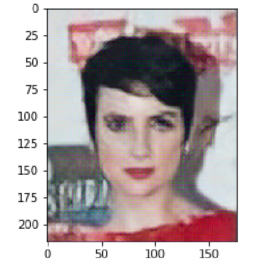
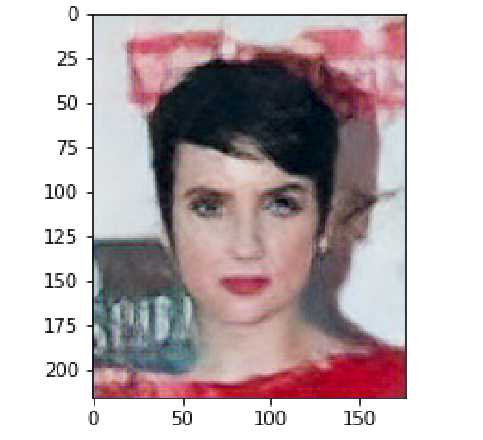
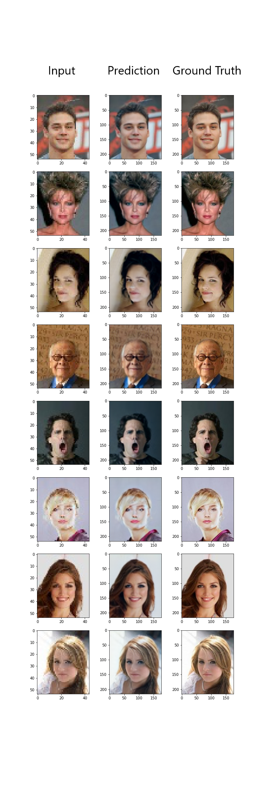

# SRGAN

Note: This code is built under TensorFlow 2.2.0.

## SRGAN Architecture

Paper: ["Photo-Realistic Single Image Super-Resolution Using a Generative Adversarial Network"](https://arxiv.org/abs/1609.04802)

## Dateset

[CelebA](http://mmlab.ie.cuhk.edu.hk/projects/CelebA.html)

## Adjustments

I did the following things due to hardware limits:
1. Only trained with 5000 pairs of high-resolution and low-resolution images preprocessed from CelebA.
2. Extracting content loss: VGG19 --> mobilenet
3. Reduce filters in Convolution layers.
4. Use GlobalAveragePooling2D instead of Dence layer in the discriminator.
   -> Reduce parameters and time during training.

## Checkboard Effect

Replace Conv2dTranspose with UpSampling2D + Conv2D.

Conv2dTranspose vs. UpSampling2D + Conv2D 
-------------------------------------
 
## Outcome

